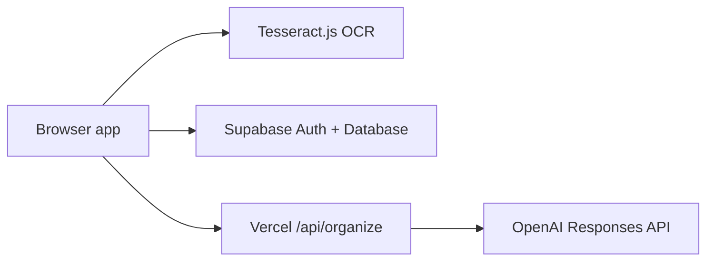
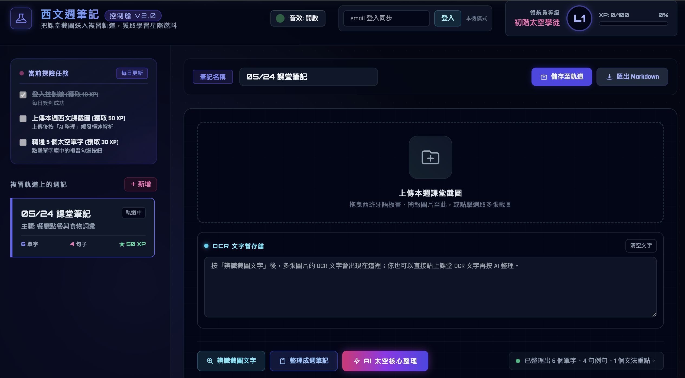

# Mi Cuaderno Español 🚀🇪🇸

AI-powered Spanish learning notebook.

Upload class screenshots → OCR → AI-organized weekly notes.

This app helps Spanish learners turn messy class screenshots and OCR text into structured weekly review notes with vocabulary, example sentences, grammar points, and Traditional Chinese translations.

## Features

- Upload multiple class screenshots
- Run browser-side OCR with Tesseract.js
- Organize OCR text with the OpenAI Responses API
- Generate weekly Spanish notes with:
  - topic
  - vocabulary
  - sentences
  - grammar
  - Traditional Chinese translations
- Sign in with Supabase email magic links
- Sync notes across devices with Supabase Database
- Keep a local browser backup with `localStorage`
- Export notes as Markdown
- Protect AI usage with Supabase Auth and optional email allowlisting

## Architecture



See the full architecture diagram in [docs/architecture.md](docs/architecture.md).

## Screenshot



## Tech Stack

- Frontend: HTML, Tailwind CDN, vanilla JavaScript
- OCR: Tesseract.js
- Auth and database: Supabase
- AI organization: OpenAI Responses API
- Hosting and API route: Vercel

## Local Development

Create a local environment file:

```bash
cp .env.example .env
```

Fill in:

```txt
OPENAI_API_KEY=your_openai_api_key
OPENAI_MODEL=gpt-5.5
SUPABASE_URL=your_supabase_project_url
SUPABASE_ANON_KEY=your_supabase_anon_public_key
ALLOWED_AI_EMAILS=your_email@example.com
```

Start the local server:

```bash
set -a
source .env
set +a
node server.mjs
```

Open:

```txt
http://localhost:4173
```

## Vercel Deployment

Set these environment variables in Vercel:

```txt
OPENAI_API_KEY=your_openai_api_key
OPENAI_MODEL=gpt-5.5
SUPABASE_URL=your_supabase_project_url
SUPABASE_ANON_KEY=your_supabase_anon_public_key
ALLOWED_AI_EMAILS=your_email@example.com
```

`ALLOWED_AI_EMAILS` is optional. If it is empty, any signed-in user can use AI organization. If set, only matching emails can use `/api/organize`.

## Supabase Setup

Run the schema in [supabase/schema.sql](supabase/schema.sql) inside the Supabase SQL Editor.

The app expects this table:

```txt
public.notes
```

If you see this error:

```txt
Could not find the table 'public.notes' in the schema cache
```

it means the schema has not been created in the Supabase project that the app is currently connected to.

## Security Notes

- OpenAI API keys are read only from server-side environment variables.
- The browser never receives the OpenAI API key.
- `/api/organize` requires a valid Supabase access token.
- `ALLOWED_AI_EMAILS` can restrict AI usage to selected email addresses.
- Supabase Row Level Security limits users to their own notes.
- Supabase anon keys are public by design, but this project loads them from environment variables so the repository can stay reusable.

## License

Personal learning project.
