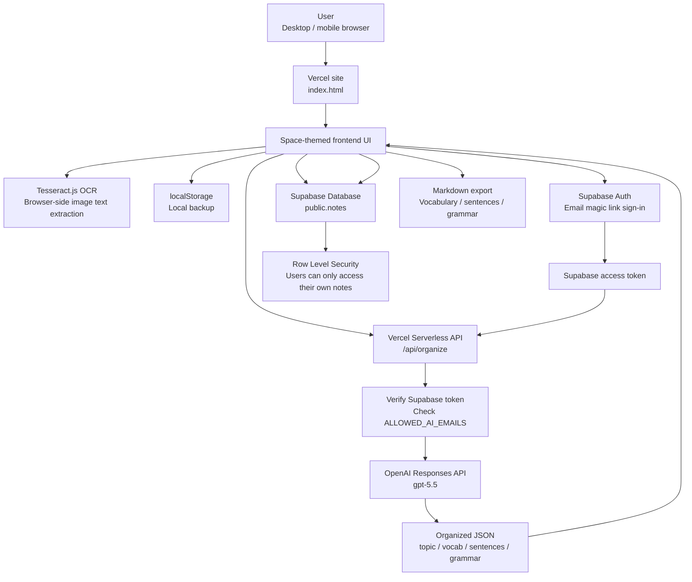
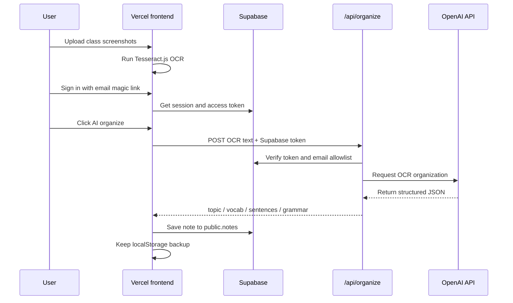

# Architecture

Mi Cuaderno Español is a browser-first learning app with a small serverless API layer.

In one sentence: **Vercel frontend + Vercel API route + Supabase Auth/Database + OpenAI organization + browser OCR/localStorage backup**.

## System Overview

## AI Organization Flow

## Data Storage

- `public.notes`: primary cloud note storage protected by Supabase Row Level Security.
- `localStorage`: browser-side backup for offline or not-yet-signed-in usage.
- Markdown export: manual offline export created by the user.

## Security Boundaries

- The OpenAI API key is only read from server-side environment variables.
- The browser never receives the OpenAI API key.
- `/api/organize` requires a valid Supabase access token.
- `ALLOWED_AI_EMAILS` can restrict AI usage to selected email addresses.
- Supabase RLS policies limit users to their own notes.
- Supabase anon keys are public by design, but this project loads them from environment variables to keep the repository reusable.
